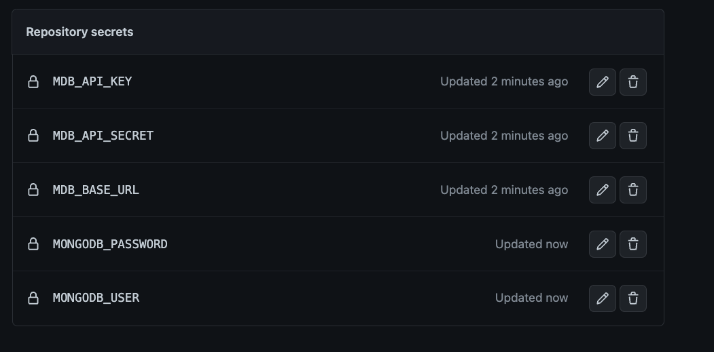

# Atlas Github Action

> NOTE: This project is just an experiment done by Atlas Community. 
Please use at your own responsibility.

## Usage with free clusters

Action by default creates MongoDB atlas M0 cluster, waits for it to start and then returns url to be used in other steps.
Thanks to finetuning of the arguments creation of the cluster usually takes 20-30 seconds max. 

```yaml
jobs:
  # test action works running from the graph
  test:
    runs-on: ubuntu-latest
    steps:
    - uses: wtrocki/atlas-github-action@main
      id: createAtlasCluster
      with:
        ## Project ID
        projectId: 63b6e19c362d4278259cffc7
        ## Name of cluster
        name: my-cluster
        ## Reuse existing cluster instead of creating new one
        reuse: false
      env:
        ## Auth
        MDB_API_KEY: ${{ secrets.MDB_API_KEY }}
        MDB_API_SECRET: ${{ secrets.MDB_API_KEY }}
        ## MongoDB connection credentials
        MONGODB_USER: ${{ secrets.MONGODB_USER }}
        MONGODB_PASSWORD: ${{ secrets.MONGODB_PASSWORD }}
      - run: 
          ## Prints cluster url to connect with the cluster
          echo ${{steps.createAtlasCluster.outputs.clusterURL}}
```

Environment variables require number of github secrets to be created:



## Usage with dedicated clusters

For any other type of cluster set `reuse: true`. Action will make sure that proper user and access rules are created. 
 
## Notes

This project is using Atlas TypeScript Community SDK.
See: https://github.com/wtrocki/ts-client-atlas/ for more information
